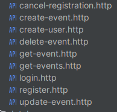

# Простое Rest API на Gin фреймворке

Реализация CRUD Rest API на фреймворке Gin с авторизацией по JWT токену.

В качестве базы данной была использована SQLite.

Список доступного апи.



## Запуск проекта

```bash
go run main.go
```
